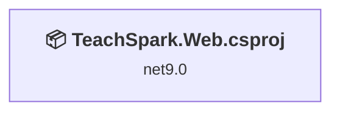
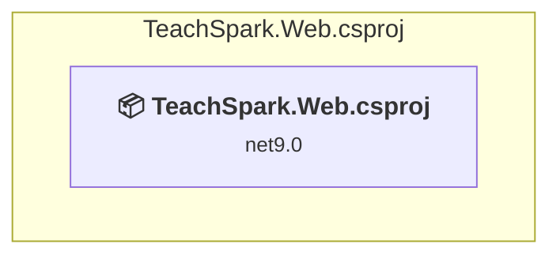

# Projects and dependencies analysis

Status: .NET 10 upgrade completed; the details below reflect the pre-upgrade assessment (net9.0 baseline) and are retained for historical reference.

This document provides a comprehensive overview of the projects and their dependencies in the context of upgrading to .NET 9.0.

## Table of Contents

- [Projects Relationship Graph](#projects-relationship-graph)
- [Project Details](#project-details)

  - [TeachSpark.Web\TeachSpark.Web.csproj](#teachsparkwebteachsparkwebcsproj)
- [Aggregate NuGet packages details](#aggregate-nuget-packages-details)

## Projects Relationship Graph

Legend:
📦 SDK-style project
⚙️ Classic project

## Project Details

### TeachSpark.Web\TeachSpark.Web.csproj

#### Project Info

- **Current Target Framework:** net9.0
- **Proposed Target Framework:** net10.0
- **SDK-style**: True
- **Project Kind:** AspNetCore
- **Dependencies**: 0
- **Dependants**: 0
- **Number of Files**: 155
- **Lines of Code**: 31190

#### Dependency Graph

Legend:
📦 SDK-style project
⚙️ Classic project

#### Project Package References

| Package | Type | Current Version | Suggested Version | Description |
| :--- | :---: | :---: | :---: | :--- |
| CsvHelper | Explicit | 33.1.0 |  | ✅Compatible |
| Markdig | Explicit | 0.41.3 |  | ✅Compatible |
| Microsoft.AspNetCore.Identity.EntityFrameworkCore | Explicit | 9.0.6 | 10.0.0 | NuGet package upgrade is recommended |
| Microsoft.AspNetCore.Identity.UI | Explicit | 9.0.6 | 10.0.0 | NuGet package upgrade is recommended |
| Microsoft.EntityFrameworkCore.Sqlite | Explicit | 9.0.6 | 10.0.0 | NuGet package upgrade is recommended |
| Microsoft.EntityFrameworkCore.Tools | Explicit | 9.0.6 | 10.0.0 | NuGet package upgrade is recommended |
| Microsoft.Extensions.AI | Explicit | 9.6.0 |  | ✅Compatible |
| Microsoft.Extensions.AI.OpenAI | Explicit | 9.6.0-preview.1.25310.2 |  | ✅Compatible |
| Microsoft.VisualStudio.Web.CodeGeneration.Design | Explicit | 9.0.0 | 10.0.0-rc.1.25458.5 | NuGet package upgrade is recommended |
| OpenAI | Explicit | 2.2.0 |  | ✅Compatible |
| Serilog | Explicit | 4.3.0 |  | ✅Compatible |
| Serilog.Enrichers.Context | Explicit | 4.6.5 |  | ✅Compatible |
| Serilog.Extensions.Logging | Explicit | 9.0.2 |  | ✅Compatible |
| Serilog.Sinks.Console | Explicit | 6.0.0 |  | ✅Compatible |
| Serilog.Sinks.File | Explicit | 7.0.0 |  | ✅Compatible |

## Aggregate NuGet packages details

| Package | Current Version | Suggested Version | Projects | Description |
| :--- | :---: | :---: | :--- | :--- |
| CsvHelper | 33.1.0 |  | [TeachSpark.Web.csproj](#teachsparkwebcsproj) | ✅Compatible |
| Markdig | 0.41.3 |  | [TeachSpark.Web.csproj](#teachsparkwebcsproj) | ✅Compatible |
| Microsoft.AspNetCore.Identity.EntityFrameworkCore | 9.0.6 | 10.0.0 | [TeachSpark.Web.csproj](#teachsparkwebcsproj) | NuGet package upgrade is recommended |
| Microsoft.AspNetCore.Identity.UI | 9.0.6 | 10.0.0 | [TeachSpark.Web.csproj](#teachsparkwebcsproj) | NuGet package upgrade is recommended |
| Microsoft.EntityFrameworkCore.Sqlite | 9.0.6 | 10.0.0 | [TeachSpark.Web.csproj](#teachsparkwebcsproj) | NuGet package upgrade is recommended |
| Microsoft.EntityFrameworkCore.Tools | 9.0.6 | 10.0.0 | [TeachSpark.Web.csproj](#teachsparkwebcsproj) | NuGet package upgrade is recommended |
| Microsoft.Extensions.AI | 9.6.0 |  | [TeachSpark.Web.csproj](#teachsparkwebcsproj) | ✅Compatible |
| Microsoft.Extensions.AI.OpenAI | 9.6.0-preview.1.25310.2 |  | [TeachSpark.Web.csproj](#teachsparkwebcsproj) | ✅Compatible |
| Microsoft.VisualStudio.Web.CodeGeneration.Design | 9.0.0 | 10.0.0-rc.1.25458.5 | [TeachSpark.Web.csproj](#teachsparkwebcsproj) | NuGet package upgrade is recommended |
| OpenAI | 2.2.0 |  | [TeachSpark.Web.csproj](#teachsparkwebcsproj) | ✅Compatible |
| Serilog | 4.3.0 |  | [TeachSpark.Web.csproj](#teachsparkwebcsproj) | ✅Compatible |
| Serilog.Enrichers.Context | 4.6.5 |  | [TeachSpark.Web.csproj](#teachsparkwebcsproj) | ✅Compatible |
| Serilog.Extensions.Logging | 9.0.2 |  | [TeachSpark.Web.csproj](#teachsparkwebcsproj) | ✅Compatible |
| Serilog.Sinks.Console | 6.0.0 |  | [TeachSpark.Web.csproj](#teachsparkwebcsproj) | ✅Compatible |
| Serilog.Sinks.File | 7.0.0 |  | [TeachSpark.Web.csproj](#teachsparkwebcsproj) | ✅Compatible |

